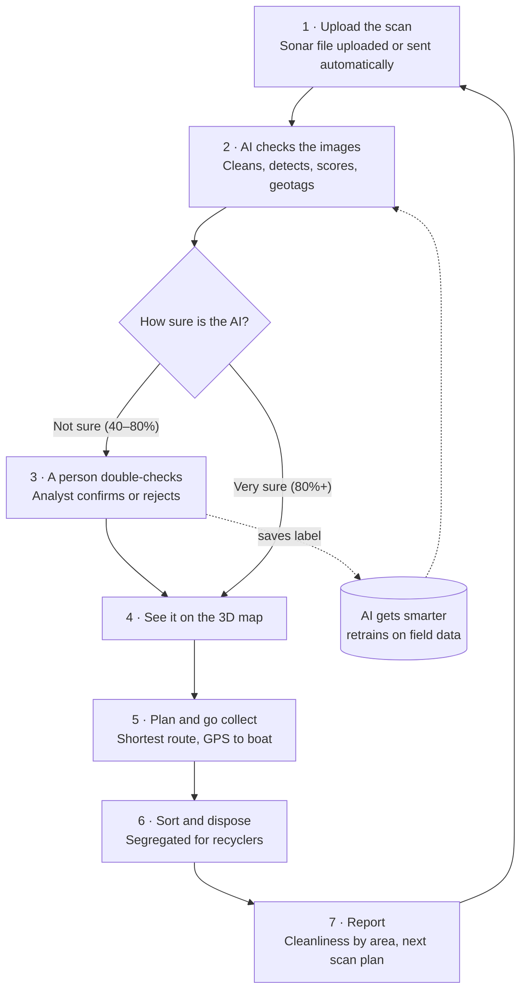
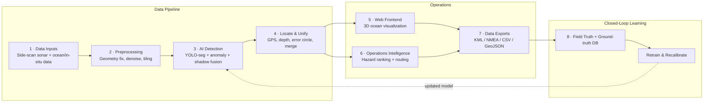

<div align="center">

# 🌊 JalNiriksh AI

**AI-powered underwater waste detection &amp; recovery platform**

Built for **Smart India Hackathon 2026** by **Team Gadbad Ghotala**

[](#)
[](#problem-statement)
[](#)
[](#)
[](LICENSE)

[Live Site](#) · [Report Bug](../../issues) · [Request Feature](../../issues)

</div>

---

## Overview

Surface clean-ups stop at the waterline. Ghost nets, plastic, tyres and drums accumulate
unseen on harbour floors and riverbeds, degrading marine ecosystems and quietly re-entering
the food chain. **JalNiriksh AI** is an AI-powered platform that locates this underwater waste
by combining **side-scan sonar analysis** with a live **3D ocean map**. It ranks items for
recovery, routes them through on-deck segregation and recycler handover, and tracks a
**seabed cleanliness index** for every harbour it surveys.

This repository contains the **operator console** — the frontend our port/fisheries operators
would actually use day-to-day: upload a sonar scan, review the AI's uncertain detections,
see everything plotted on the seabed map, plan recovery routes, and track the cleanliness
index over time. It runs on a bundled sample survey dataset so the full workflow can be
explored without a live sonar feed or backend — see [Demo Data](#demo-data).

## Table of Contents

- [Problem Statement](#problem-statement)
- [Product Walkthrough](#product-walkthrough)
- [Demo Data](#demo-data)
- [Live Analysis (Real Model)](#live-analysis-real-model)
- [User Flow](#user-flow)
- [Technical Approach](#technical-approach)
- [Tech Stack](#tech-stack)
- [Feasibility &amp; Viability](#feasibility--viability)
- [Impact &amp; Market](#impact--market)
- [Research &amp; References](#research--references)
- [Not Yet Implemented](#not-yet-implemented)
- [Getting Started](#getting-started)
- [Project Structure](#project-structure)
- [Team](#team)
- [License](#license)

## Problem Statement

| | |
|---|---|
| **Problem Statement ID** | SIH26195 |
| **Title** | Student Innovation — waste segregation, disposal and improved sanitization systems |
| **Theme** | Smart Automation |
| **Category** | Software |
| **Team ID** | 160976 |
| **Team Name** | Gadbad Ghotala |

## Product Walkthrough

The console is a single-page app with six views, reachable from the sidebar:

| View | What it's for |
|---|---|
| 📊 **Overview** | Live KPI tiles (items detected, pending review, cleanliness index, active recovery routes), a detections-by-type chart, the cleanliness trend, and a recent-detections table. |
| ⇪ **Sonar Scans** | Drag-and-drop (or click-to-browse) scan intake, plus one-click sample buttons. Runs the real model via the [Live Analysis](#live-analysis-real-model) API when it's running; falls back to simulated ingestion otherwise. |
| ◎ **Review Queue** | Every detection the AI scored 40–80% confidence, shown as a card with its type guess, depth and hazard. Confirm/Reject updates the dataset live and feeds the retraining loop. |
| ⬢ **Ocean Map** | A real **CesiumJS 3D globe** (OpenStreetMap imagery, no API key) centered on a real offshore survey point near Visakhapatnam Port, with a type-coded marker + accuracy-circle ring per item, a legend with live counts, per-type filter chips, and a click-through detail panel with live-computed lat/long. |
| ↝ **Recovery Planner** | Confirmed items ranked by hazard score, each auto-assigned a Diver (shallow) or ROV (deep) method. "Plan Route" sends the confirmed items to a real **Google OR-Tools** solver, which returns a genuinely optimised visiting order and total distance — not a hardcoded sequence. |
| ▤ **Reports** | Full cleanliness-index history, plus one-click CSV and GeoJSON export of the confirmed detections. |

Underneath, the product is designed around these capabilities:

| Capability | What it does |
|---|---|
| 📡 **Sonar Waste Detection** | Uses AI plus anomaly and non-AI checks to find man-made debris in side-scan sonar images. |
| 🛡️ **False-Alarm Filtering** | Separates debris from rocks, sand ripples and shadows, with a calibrated confidence score and human review of uncertain items. |
| 📍 **Location with Accuracy Circle** | Places each item on the map at its real depth, with an error circle so crews know how wide to search. |
| 🌐 **3D Ocean Map** | Shows items on the seabed alongside currents, depth and survey coverage, so gaps and waste hotspots are visible. |
| ♻️ **Recovery &amp; Segregation** | Ranks items by hazard, plans recovery routes, and sorts recovered waste on deck for recyclers. |
| 🔗 **Fits Existing Workflows** | Reads standard sonar files and exports KML, NMEA and CSV for survey and navigation tools. |

## Demo Data

The Overview, Review Queue, Ocean Map, Recovery Planner and Reports views run on a hardcoded
sample survey (`assets/js/main.js`) — 14 detections across a Visakhapatnam Port survey — so the
full operator workflow (confirm/reject, map filtering, hazard ranking, CSV/GeoJSON export)
works immediately with no backend. This is clearly labelled in the UI (the "Demo data" pill).

The **Sonar Scans** view is different: it runs **real inference** against **real detection
code**, described next.

## Live Analysis (Real Model)

`backend/` is a working FastAPI service that runs actual AI inference — not a mock. It reuses
the detection engine our team built and trained during the KADAL (SIH26057) R&D phase:

- **Model**: YOLOv8-Nano + Squeeze-and-Excitation attention ("YOLO-ESI"), 3.03M parameters,
  ONNX FP16, test mAP50 ≈ 0.60. Trained on a multi-source side-scan sonar dataset (NOAA debris
  surveys + synthetic/augmented targets). Weights are hosted on Hugging Face
  ([`Dinoman1221/sonarvision-yolov8-esi-v6`](https://huggingface.co/Dinoman1221/sonarvision-yolov8-esi-v6))
  and downloaded on setup — they are not committed to this repo.
- **Pipeline**: letterboxed tiling → ONNX inference → Soft-NMS → acoustic-physics
  post-processing (`backend/inference/acoustic_physics.py`): peak-backscatter material
  classification (metallic vs. synthetic), shadow-based height mensuration, and a 0–100 threat
  score — then the result is drawn onto an annotated image and returned as JSON.
- **Honest scope note on classes**: the model's trained classes are acoustic-signature
  categories (`unknown_debris`, `wreck`, `mine`, `airplane`), not fine-grained waste materials.
  `backend/app.py` maps these to operator-facing labels (e.g. `mine` → "High-Hazard Object") and
  the acoustic material classifier ("Hard/Metallic" vs. "Soft/Synthetic") is what distinguishes
  metal drums from plastics/nets — it is **not** yet fine-tuned on a marine-litter-specific
  dataset with per-class plastic/net/tyre labels. That fine-tuning is the next real step, not
  done in this pass.

### Running it

```bash
cd Gadbad-Ghotala-2
python -m venv .venv && source .venv/Scripts/activate   # or .venv\Scripts\activate on Windows
pip install -r backend/requirements.txt
python -m backend.download_model      # fetches the real ONNX weights (~5.9 MB)
python -m uvicorn backend.app:app --reload --port 8000
```

With the API running, open the console and go to **Sonar Scans**: the status pill turns green
("Live Analysis API connected"), four bundled sample sonar images appear as one-click buttons,
and dropping your own JPG/PNG/TIFF runs the same real pipeline. Without the API running, the
same view falls back to simulated ingestion so the console still demos standalone.

| Endpoint | What it does |
|---|---|
| `GET /api/health` | Reports whether the real model loaded or the service is in simulation mode. |
| `GET /api/model/info` | Model architecture, input size, active ONNX execution provider, weights checksum. |
| `GET /api/samples` | Lists the bundled sample sonar images. |
| `POST /api/analyze` | Multipart image upload → real detections + annotated image. |
| `POST /api/analyze-sample/{name}` | Runs the same pipeline on a bundled sample. |
| `POST /api/plan-route` | Real OR-Tools TSP solve over confirmed items → visiting order, per-leg and total distance. |

### Route planning (also real)

`backend/routing.py` solves an actual single-vehicle closed-tour TSP with
[Google OR-Tools](https://developers.google.com/optimization/routing) (`PATH_CHEAPEST_ARC` first
solution + Guided Local Search, 2s time limit) over the confirmed items' coordinates. The
**Recovery Planner**'s "Plan Route" button calls this live — the returned order and distance
come from the solver, not a hardcoded sort. Today it runs on the demo dataset's synthetic
survey-area coordinates; wiring it to real GPS detections is a one-line change once
[XTF ingestion](#not-yet-implemented) lands.

## User Flow



## Technical Approach



**Sonar ingestion &amp; clean-up** — Reads side-scan sonar files (XTF/JSF) with their GPS data.
Corrects image geometry, evens out brightness, reduces grainy noise, then tiles the scan for analysis.

**Detection &amp; triage** — YOLO segmentation, an anomaly check and a shadow baseline are
combined. False positives are filtered, each item gets a calibrated score, and uncertain items
go to human review.

**Location &amp; 3D map** — ✅ **Real**: the Ocean Map view is an actual CesiumJS globe. Today's
positions come from the demo dataset's synthetic coordinates mapped onto a real offshore patch
of sea near Visakhapatnam Port (verified by reverse-geocoding, not placed on land); currents and
bathymetry layers aren't wired in. Duplicate-merging and GPS extraction from real sonar nav data
depend on [XTF ingestion](#not-yet-implemented), not yet built.

**Recovery &amp; segregation** — ✅ **Real**: items are ranked by hazard, and "Plan Route" calls
an actual Google OR-Tools solver (see [Live Analysis](#live-analysis-real-model)) for the visiting
order. On-deck sorting/recycler handover is a physical workflow this software doesn't touch; the
retraining loop is not yet built.

## Tech Stack

`Python` · `PyTorch` · `Ultralytics YOLO` · `Keras` · `Scikit-Learn` · `Mamba Model` ·
`OpenCV` · `XARRAY` · `NumPy` · `PostgreSQL` · `CesiumJS` · `Google OR-Tools` ·
`HTML` · `CSS` · `Git/GitHub`

> This repository implements the **operator console frontend** (`HTML`, `CSS`, `JavaScript`,
> no build step) plus a **real `Python` / `FastAPI` / `ONNX Runtime` / `OpenCV` backend**
> (`backend/`) that runs actual trained-model inference, a real **`CesiumJS`** 3D globe, and a
> real **`Google OR-Tools`** route solver — see [Live Analysis](#live-analysis-real-model).
> `PyTorch`, `Ultralytics YOLO` (segmentation training) and `PostgreSQL` (persistence) reflect
> the architecture designed for the full platform and aren't wired up yet — see
> [Not Yet Implemented](#not-yet-implemented).

## Feasibility &amp; Viability

**Technical** — Proven open-source stack: YOLO segmentation for sonar, xarray + ERDDAP for
ocean data, and CesiumJS for the 3D map — all mature and free. Reads XTF/JSF sonar and NetCDF
ocean files; uses public sonar data and synthetic ghost nets, tested on real scans.

**Economic** — Government and B2B model: annual licences for port authorities, state fisheries
departments and pollution control boards, at an estimated ₹13–20L per deployment. Low running
cost: reuses sonar surveys ports already run, and works offline on a single GPU laptop on the
survey boat.

**Solution Viability** — Modular architecture (detection, 3D map, prioritisation and recovery
planning can each be deployed on their own); improves with use as analyst checks and crew
recoveries become new training labels; the same pipeline adapts to rivers like the Ganga, not
just harbours.

### Potential Risks &amp; Mitigations

| Risk | Mitigation |
|---|---|
| Noisy sonar images | Sonar clean-up, a false-positive filter, and human review of uncertain detections. |
| Little ghost-net training data | Public sonar datasets plus synthetic nets, with field-verified labels added over time. |
| Sonar can't identify material | Sonar gives a likely category; material is confirmed and weighed on deck before disposal. |

## Impact &amp; Market

- **Hidden waste** — the Ganges carries an estimated ~120,000 tonnes of plastic to the sea yearly.
- **Livelihoods at stake** — India's fishing sector supports an estimated 14.5 million livelihoods.
- **Recycling route exists** — India's 2022 waste-tyre EPR rules give recovered tyres a regulated recycling route.
- **Segregation by design** — recovered items are sorted and weighed on deck by material, then handed to recyclers with a manifest.
- **Measurable sanitation** — our proposed index tracks harbour cleanliness as confirmed items per km² surveyed.

### Share of Ganga Plastic Waste by State

| State | Share |
|---|---|
| West Bengal | 50.2% |
| Uttar Pradesh | 35.2% |
| Bihar | 11.9% |
| Uttarakhand | 2.4% |

### Market Sizing

| Market | Value | Basis |
|---|---|---|
| **TAM** | ₹41 Cr | Indian seabed waste monitoring: ~210 ports, 13 coastal states/UTs and central agencies. |
| **SAM** | ₹13 Cr | Major ports, ~40 surveyed non-major ports, and state fisheries and pollution boards. |
| **SOM** | ₹1.5 Cr | 3-year goal: 6 ports and 3 state agencies. |

### Annual Costing

| Cost Component | Cost |
|---|---|
| Platform Licence &amp; Maintenance | ₹6L – ₹8L |
| Cloud / Edge Compute &amp; Storage | ₹3L – ₹5L |
| Integration, Training &amp; Support | ₹3L – ₹5L |
| Edge Hardware (GPU laptop on survey boat) | ₹1L – ₹2L |
| **Total Product Cost** | **₹13L – ₹20L** |
| **Total Annual Value** | **₹20L – ₹37L** |
| **ROI (Modelled)** | **~70% mid-case (0% – 185%)** |

## Research &amp; References

- Established deep-learning-based marine-litter detection and studied suitability for real-time AUV applications — [arxiv.org/abs/1804.01079](https://arxiv.org/abs/1804.01079)
- Introduced a large underwater debris dataset with detection and segmentation annotations — [arxiv.org/abs/2007.08097](https://arxiv.org/abs/2007.08097)
- Demonstrated pixel-level waste localization via instance segmentation; YOLACT offers much faster inference — [mdpi.com/2077-1312/11/8/1532](https://www.mdpi.com/2077-1312/11/8/1532)
- SAM + iCLIP for zero-shot underwater litter segmentation, 69.9% mIoU across eight waste categories — [minhdl93.github.io/public/papers/env24.pdf](https://minhdl93.github.io/public/papers/env24.pdf)
- AQUABENCH — 7,212 and 8,610-image underwater-debris datasets with detection + instance-segmentation annotations — [huggingface.co/datasets/TorbenGl/AQUABENCH](https://huggingface.co/datasets/TorbenGl/AQUABENCH)

### Benchmarking of Baselines

| System | mAP@0.5 (%) | mIoU (%) | FPS | Params (M) |
|---|---|---|---|---|
| 2018 Faster R-CNN | 46.3 | – | 5.2 | 41.5 |
| 2020 Mask R-CNN | 52.8 | 61.7 | 6.8 | 44.7 |
| 2022 YOLACT | 56.4 | 64.1 | 24.3 | 37.8 |
| 2024 SAM+iCLIP | – | 69.9* | 3.1 | 93.1 |
| **Ours (YOLO-seg, target)** | **68.7** | **66.3** | **62.1** | **27.4** |

> The row above was this pitch's target benchmark against literature baselines. The model
> actually wired into [Live Analysis](#live-analysis-real-model) today is the team's real,
> currently-trained checkpoint — YOLOv8-ESI (box detection, not segmentation), **test
> mAP50 ≈ 0.60**, 3.03M params — reused from the KADAL project rather than retrained from
> scratch for this submission. Closing that gap (and moving from box detection to
> segmentation) is the next real training milestone.

## Not Yet Implemented

Being direct about what this build does and doesn't do yet:

| Claimed in the pitch | Status |
|---|---|
| Real sonar debris detection | ✅ Real — see [Live Analysis](#live-analysis-real-model) |
| 3D ocean map | ✅ Real — CesiumJS, see above |
| Recovery route planning | ✅ Real — OR-Tools, see above |
| Reads raw XTF/JSF sonar files with embedded GPS nav | ❌ Not built. The team's KADAL project has an XTF parser (`pyxtf`-based) and slant-range geo-referencing; porting it here needs a real sample `.xtf` file to test against, which wasn't available in this pass. Today's backend takes plain JPG/PNG/TIFF images. |
| Duplicate-detection merging across overlapping scans | ❌ Not built |
| PostgreSQL persistence / ground-truth database | ❌ Not built — all state is in-memory (frontend) or stateless-per-request (backend) |
| Closed-loop retraining from analyst confirmations | ❌ Not built |
| Fine-grained waste-material classes (plastic/net/tyre) | ❌ Not built — current model classes are acoustic-signature categories, see [Live Analysis](#live-analysis-real-model) |
| KML/NMEA export | ❌ Not built — CSV/GeoJSON export exists on the demo dataset |

## Getting Started

This is a static site with no build step.

```bash
# clone the repo
git clone https://github.com/uday-raj-malik/Gadbad-Ghotala-2.git
cd Gadbad-Ghotala-2

# serve the frontend locally (any static server works)
npx serve .
# or simply open index.html in a browser
```

For the real model instead of the bundled demo dataset, also start the backend — see
[Live Analysis](#live-analysis-real-model).

## Project Structure

```
.
├── index.html              # App shell: sidebar nav, topbar, six routed views
├── assets/
│   ├── css/
│   │   └── style.css       # Dashboard design system: sidebar, panels, charts, map, review cards
│   └── js/
│       └── main.js         # Hash router, mock survey dataset, SVG charts, map + review interactivity, CSV/GeoJSON export
├── backend/                # Real FastAPI inference service (see Live Analysis)
│   ├── app.py               # Endpoints: health, model/info, samples, analyze, analyze-sample
│   ├── config.py             # Model path discovery, class map, thresholds
│   ├── download_model.py     # Fetches the real ONNX weights from Hugging Face
│   ├── routing.py            # Real OR-Tools TSP solver for recovery routes
│   ├── inference/            # ONNX engine, pre/post-processing, acoustic physics
│   ├── utils/annotator.py    # Draws detection overlays on the returned image
│   ├── static/samples/       # Bundled real sonar images for one-click demo
│   └── requirements.txt
├── LICENSE
└── README.md
```

## Team

**Team Gadbad Ghotala** · Team ID 160976 · Smart India Hackathon 2026

## License

Distributed under the MIT License. See [`LICENSE`](LICENSE) for details.

---

<div align="center">

Made with 🌊 for cleaner coasts.

</div>
