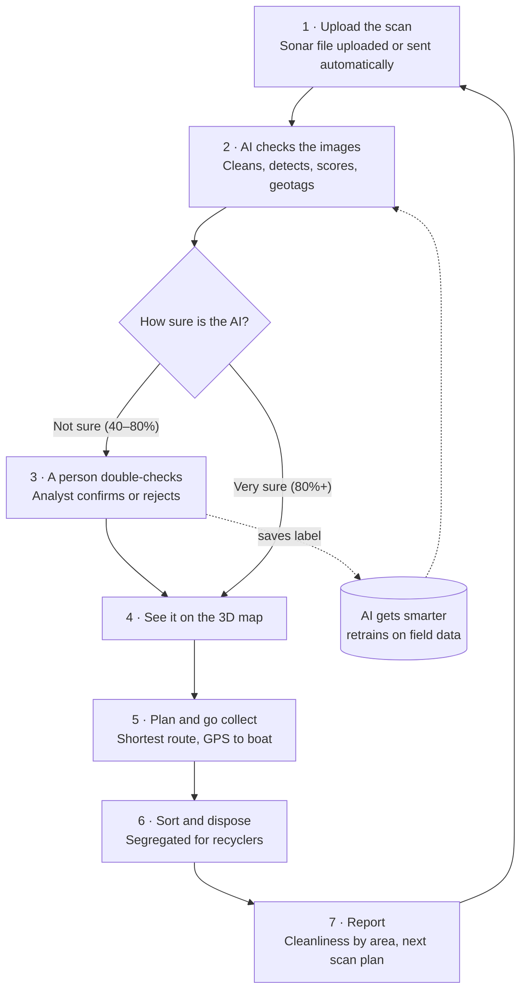
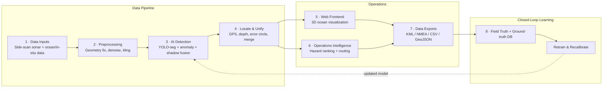

<div align="center">

# 🌊 JalNiriksh AI

**AI-powered underwater waste detection &amp; recovery platform**

Built for **Smart India Hackathon 2026** by **Team Gadbad Ghotala**

[](#)
[](#problem-statement)
[](#)
[](#)
[](LICENSE)

[Live Site](#) · [Report Bug](../../issues) · [Request Feature](../../issues)

</div>

---

## Overview

Surface clean-ups stop at the waterline. Ghost nets, plastic, tyres and drums accumulate
unseen on harbour floors and riverbeds, degrading marine ecosystems and quietly re-entering
the food chain. **JalNiriksh AI** is an AI-powered platform that locates this underwater waste
by combining **side-scan sonar analysis** with a live **3D ocean map**. It ranks items for
recovery, routes them through on-deck segregation and recycler handover, and tracks a
**seabed cleanliness index** for every harbour it surveys.

This repository contains the product pitch site for our SIH 2026 submission — a single-page
walkthrough of the problem, solution, architecture, feasibility and research behind JalNiriksh AI.

## Table of Contents

- [Problem Statement](#problem-statement)
- [Our Solution](#our-solution)
- [User Flow](#user-flow)
- [Technical Approach](#technical-approach)
- [Tech Stack](#tech-stack)
- [Feasibility &amp; Viability](#feasibility--viability)
- [Impact &amp; Market](#impact--market)
- [Research &amp; References](#research--references)
- [Getting Started](#getting-started)
- [Project Structure](#project-structure)
- [Team](#team)
- [License](#license)

## Problem Statement

| | |
|---|---|
| **Problem Statement ID** | SIH26195 |
| **Title** | Student Innovation — waste segregation, disposal and improved sanitization systems |
| **Theme** | Smart Automation |
| **Category** | Software |
| **Team ID** | 160976 |
| **Team Name** | Gadbad Ghotala |

## Our Solution

An AI-powered platform that locates underwater waste such as ghost nets, plastic, tyres,
drums and more. It combines side-scan sonar analysis with a 3D ocean map to rank items for
recovery, then routes them through on-deck segregation and recycler handover, with a seabed
cleanliness index to track each harbour.

| Capability | What it does |
|---|---|
| 📡 **Sonar Waste Detection** | Uses AI plus anomaly and non-AI checks to find man-made debris in side-scan sonar images. |
| 🛡️ **False-Alarm Filtering** | Separates debris from rocks, sand ripples and shadows, with a calibrated confidence score and human review of uncertain items. |
| 📍 **Location with Accuracy Circle** | Places each item on the map at its real depth, with an error circle so crews know how wide to search. |
| 🌐 **3D Ocean Map** | Shows items on the seabed alongside currents, depth and survey coverage, so gaps and waste hotspots are visible. |
| ♻️ **Recovery &amp; Segregation** | Ranks items by hazard, plans recovery routes, and sorts recovered waste on deck for recyclers. |
| 🔗 **Fits Existing Workflows** | Reads standard sonar files and exports KML, NMEA and CSV for survey and navigation tools. |

## User Flow



## Technical Approach



**Sonar ingestion &amp; clean-up** — Reads side-scan sonar files (XTF/JSF) with their GPS data.
Corrects image geometry, evens out brightness, reduces grainy noise, then tiles the scan for analysis.

**Detection &amp; triage** — YOLO segmentation, an anomaly check and a shadow baseline are
combined. False positives are filtered, each item gets a calibrated score, and uncertain items
go to human review.

**Location &amp; 3D map** — Items get a GPS position, depth and an error circle, with duplicates
merged, shown on a CesiumJS map alongside currents, coverage and depth.

**Recovery &amp; segregation** — Items are ranked by hazard and routed with OR-Tools; recovered
waste is sorted on deck for recyclers and retrains the model.

## Tech Stack

`Python` · `PyTorch` · `Ultralytics YOLO` · `Keras` · `Scikit-Learn` · `Mamba Model` ·
`OpenCV` · `XARRAY` · `NumPy` · `PostgreSQL` · `CesiumJS` · `Google OR-Tools` ·
`HTML` · `CSS` · `Git/GitHub`

> This repository currently implements the **pitch/landing site** (`HTML`, `CSS`, `JavaScript`)
> above. The remaining stack reflects the architecture designed for the full JalNiriksh AI
> platform, detailed in [Technical Approach](#technical-approach).

## Feasibility &amp; Viability

**Technical** — Proven open-source stack: YOLO segmentation for sonar, xarray + ERDDAP for
ocean data, and CesiumJS for the 3D map — all mature and free. Reads XTF/JSF sonar and NetCDF
ocean files; uses public sonar data and synthetic ghost nets, tested on real scans.

**Economic** — Government and B2B model: annual licences for port authorities, state fisheries
departments and pollution control boards, at an estimated ₹13–20L per deployment. Low running
cost: reuses sonar surveys ports already run, and works offline on a single GPU laptop on the
survey boat.

**Solution Viability** — Modular architecture (detection, 3D map, prioritisation and recovery
planning can each be deployed on their own); improves with use as analyst checks and crew
recoveries become new training labels; the same pipeline adapts to rivers like the Ganga, not
just harbours.

### Potential Risks &amp; Mitigations

| Risk | Mitigation |
|---|---|
| Noisy sonar images | Sonar clean-up, a false-positive filter, and human review of uncertain detections. |
| Little ghost-net training data | Public sonar datasets plus synthetic nets, with field-verified labels added over time. |
| Sonar can't identify material | Sonar gives a likely category; material is confirmed and weighed on deck before disposal. |

## Impact &amp; Market

- **Hidden waste** — the Ganges carries an estimated ~120,000 tonnes of plastic to the sea yearly.
- **Livelihoods at stake** — India's fishing sector supports an estimated 14.5 million livelihoods.
- **Recycling route exists** — India's 2022 waste-tyre EPR rules give recovered tyres a regulated recycling route.
- **Segregation by design** — recovered items are sorted and weighed on deck by material, then handed to recyclers with a manifest.
- **Measurable sanitation** — our proposed index tracks harbour cleanliness as confirmed items per km² surveyed.

### Share of Ganga Plastic Waste by State

| State | Share |
|---|---|
| West Bengal | 50.2% |
| Uttar Pradesh | 35.2% |
| Bihar | 11.9% |
| Uttarakhand | 2.4% |

### Market Sizing

| Market | Value | Basis |
|---|---|---|
| **TAM** | ₹41 Cr | Indian seabed waste monitoring: ~210 ports, 13 coastal states/UTs and central agencies. |
| **SAM** | ₹13 Cr | Major ports, ~40 surveyed non-major ports, and state fisheries and pollution boards. |
| **SOM** | ₹1.5 Cr | 3-year goal: 6 ports and 3 state agencies. |

### Annual Costing

| Cost Component | Cost |
|---|---|
| Platform Licence &amp; Maintenance | ₹6L – ₹8L |
| Cloud / Edge Compute &amp; Storage | ₹3L – ₹5L |
| Integration, Training &amp; Support | ₹3L – ₹5L |
| Edge Hardware (GPU laptop on survey boat) | ₹1L – ₹2L |
| **Total Product Cost** | **₹13L – ₹20L** |
| **Total Annual Value** | **₹20L – ₹37L** |
| **ROI (Modelled)** | **~70% mid-case (0% – 185%)** |

## Research &amp; References

- Established deep-learning-based marine-litter detection and studied suitability for real-time AUV applications — [arxiv.org/abs/1804.01079](https://arxiv.org/abs/1804.01079)
- Introduced a large underwater debris dataset with detection and segmentation annotations — [arxiv.org/abs/2007.08097](https://arxiv.org/abs/2007.08097)
- Demonstrated pixel-level waste localization via instance segmentation; YOLACT offers much faster inference — [mdpi.com/2077-1312/11/8/1532](https://www.mdpi.com/2077-1312/11/8/1532)
- SAM + iCLIP for zero-shot underwater litter segmentation, 69.9% mIoU across eight waste categories — [minhdl93.github.io/public/papers/env24.pdf](https://minhdl93.github.io/public/papers/env24.pdf)
- AQUABENCH — 7,212 and 8,610-image underwater-debris datasets with detection + instance-segmentation annotations — [huggingface.co/datasets/TorbenGl/AQUABENCH](https://huggingface.co/datasets/TorbenGl/AQUABENCH)

### Benchmarking of Baselines

| System | mAP@0.5 (%) | mIoU (%) | FPS | Params (M) |
|---|---|---|---|---|
| 2018 Faster R-CNN | 46.3 | – | 5.2 | 41.5 |
| 2020 Mask R-CNN | 52.8 | 61.7 | 6.8 | 44.7 |
| 2022 YOLACT | 56.4 | 64.1 | 24.3 | 37.8 |
| 2024 SAM+iCLIP | – | 69.9* | 3.1 | 93.1 |
| **Ours (YOLO-seg)** | **68.7** | **66.3** | **62.1** | **27.4** |

## Getting Started

This is a static site with no build step.

```bash
# clone the repo
git clone https://github.com/uday-raj-malik/Gadbad-Ghotala-2.git
cd Gadbad-Ghotala-2

# serve it locally (any static server works)
npx serve .
# or simply open index.html in a browser
```

## Project Structure

```
.
├── index.html              # Single-page site (hero, solution, flow, tech, feasibility, impact, research)
├── assets/
│   ├── css/
│   │   └── style.css       # Design system: layout, cards, donut chart, responsive rules
│   └── js/
│       └── main.js         # Mobile nav toggle + scroll-reveal animation
├── LICENSE
└── README.md
```

## Team

**Team Gadbad Ghotala** · Team ID 160976 · Smart India Hackathon 2026

## License

Distributed under the MIT License. See [`LICENSE`](LICENSE) for details.

---

<div align="center">

Made with 🌊 for cleaner coasts.

</div>
